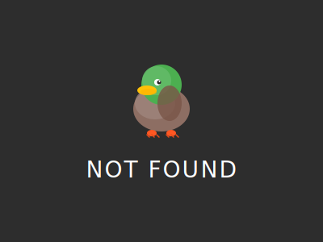

# That was experiments of updating PageNotFound with new SVG icon, but it's failed xD

## First prompt was that with attached example file

> You are an expert graphic designer specializing in Material Design. I have attached an image for reference. Create an
> SVG image that closely resembles the attached image in terms of composition, structure, and visual elements, but
> adheres
> strictly to Material Design principles (clean lines, bold colors, subtle shadows, flat design with depth, and a modern
> aesthetic). The SVG should be optimized for web use, with clean code and no unnecessary elements. Ensure the design
> uses
> a consistent color palette, typography (if applicable), and iconography aligned with Material Design guidelines.
> Output
> the complete SVG code in a code block. If the image contains specific elements (e.g., icons, shapes, or layouts),
> replicate those elements while enhancing them to fit the Material Design aesthetic. Do not include any raster images
> or
> external dependencies in the SVG.

| Model                  | Result                               |
|------------------------|--------------------------------------|
| Claude (Sonnet 4)      |    |
| Deepseek (R1)          |  |
| Gemini (2.5 Pro)       |    |
| ChatGPT (GPT-4-turbo)  |       |
| Grok (Grok 3)          |      |
| Qwen (Qwen3-235B-A22B) |      |

## Second prompt in same chat with current fStats page not found as reference

> Right now I have this. Its emoji with text. But emoji is different depend on OS, so it's bad. Can we do like it?

| Model                  | Result                                 |
|------------------------|----------------------------------------|
| Claude (Sonnet 4)      |    |
| Deepseek (R1)          |  |
| Gemini (2.5 Pro)       |    |
| ChatGPT (GPT-4-turbo)  |       |
| Grok (Grok 3)          |      |
| Qwen (Qwen3-235B-A22B) |      |